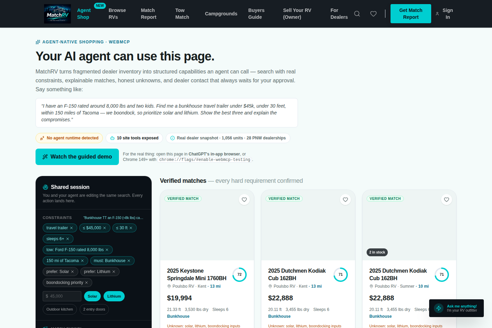
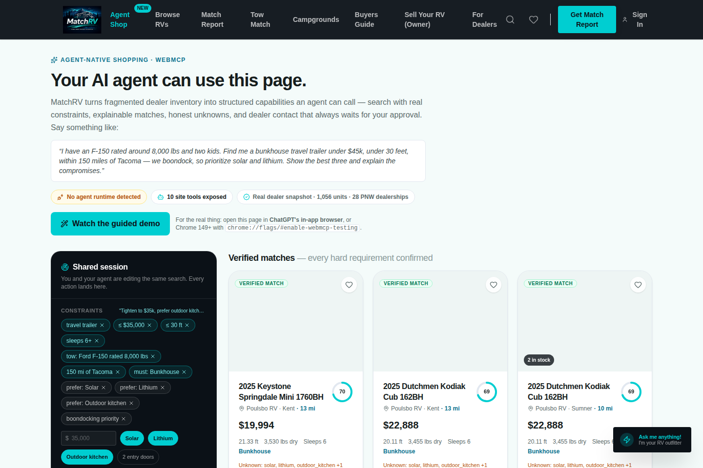
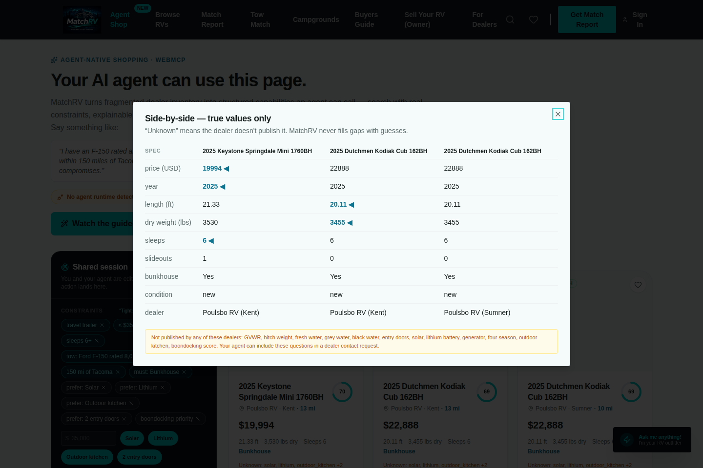
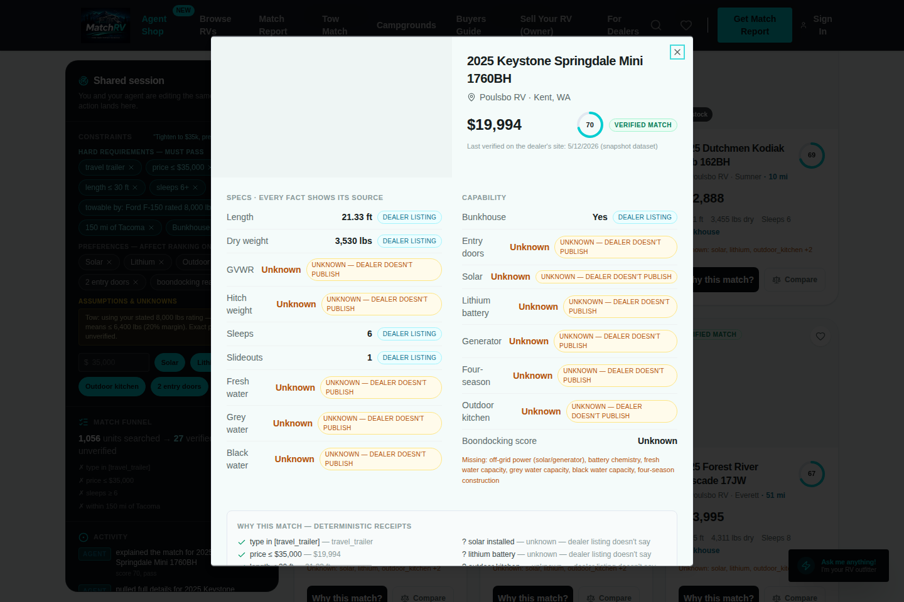
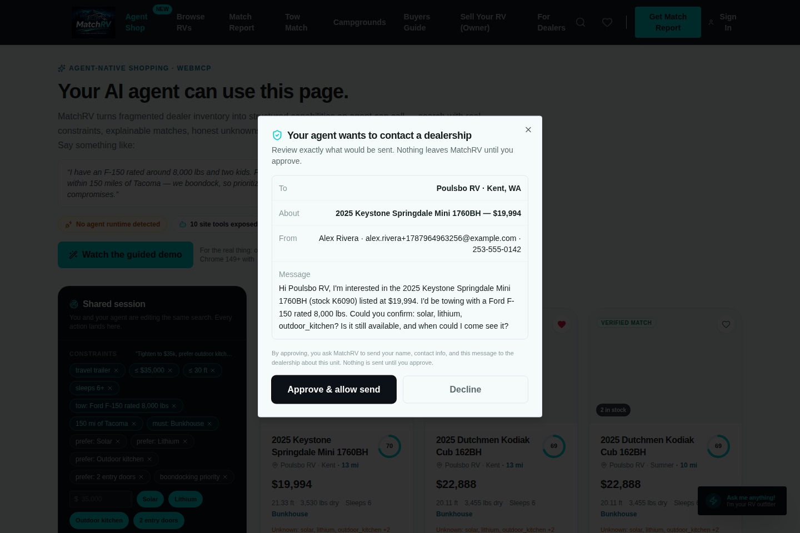
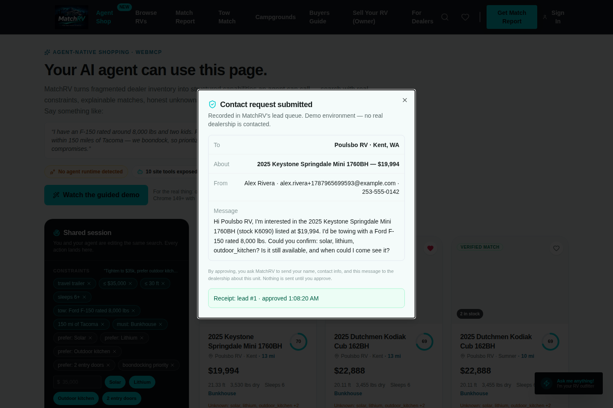

# MatchRV — the agent-native RV shopping layer

**One sentence:** MatchRV turns fragmented RV dealer inventory into structured
WebMCP capabilities, so a shopper and their AI agent can work one shared,
explainable, human-approved buying session on the same page.

Built for the [OpenAI WebMCP Challenge](https://webmcp.devpost.com/).
License: [MIT](./LICENSE) · Live demo: **https://matchrv-webmcp.onrender.com/shop** ·
Demo video: [`docs/demo/matchrv-demo.mp4`](docs/demo/matchrv-demo.mp4) (2:08, silent — narration in [`docs/demo/NARRATION.md`](docs/demo/NARRATION.md); YouTube link added at submission)



---

## The problem

Buying an RV is a five-figure decision spread across dozens of dealer websites
that all describe the same physical things differently. Today, an AI agent
asked to help has to Google dealers, open page after page, guess whether
"weight" means dry weight or GVWR, scrape HTML that changes weekly, and hope
the listing is still real. The data exists — agents just can't *use* it.

We measured it on 28 real Pacific-Northwest dealerships (1,801 scraped
listings): **GVWR is machine-readable on 0.7% of listings, fresh-water
capacity on ~1%, and battery chemistry on almost none.** That's the web agents
are being asked to shop on.

## The solution

MatchRV normalizes real dealer inventory into a canonical schema where **every
critical fact carries provenance** (dealer listing / parsed from dealer text /
decoded floorplan code / computed) and **unknown stays unknown** — then exposes
that semantic layer to agents as ten WebMCP site tools.

```
BEFORE WebMCP   agent → search web → 30 dealer sites → inconsistent HTML → guesses
AFTER WebMCP    agent → MatchRV site tools → typed constraints → explainable
                matches → human approves → dealer action
```

A shopper says, in one messy sentence:

> "I have an F-150 rated around 8,000 lbs and two kids. Find me a bunkhouse
> travel trailer under $45k, under 30 feet, within 150 miles of Tacoma — we
> boondock, so prioritize solar and lithium. Show the best three and explain
> the compromises."

Their agent compiles that into structured constraints, searches 1,056
normalized units in ~30 ms, and the page shows the same results, the same
constraint chips, and a funnel of exactly what was excluded and why. The human
tweaks a chip by hand; the agent's next call sees it. When it's time to talk
to a dealership, the agent can only *stage* the contact request — a preview of
exactly what would be sent appears on the page, and nothing goes anywhere
until the human clicks **Approve**.

## Why WebMCP (and not scraping, or a chatbot)

- **Deterministic capabilities, not DOM guessing.** `search_inventory` with a
  typed JSON Schema beats inferring a filter sidebar's semantics.
- **The page is the shared session.** WebMCP tools run *in* the page, so agent
  actions and human actions mutate one visible state — a real human+agent
  experience instead of a chatbot beside a website.
- **Progressive permissions.** Read tools carry `readOnlyHint`; the one
  consequential action is split into `prepare` (preview) and `submit`
  (server-refused until a human approves in the UI). Prompt injection can't
  cause an unauthorized write, because authorization never comes from the
  model.
- **Honesty survives the pipeline.** A scraper that guesses produces confident
  nonsense. Our tools return `null` with a provenance note, and agents relay
  it: *"lithium: unknown — the dealer doesn't publish it. Want me to ask?"*
  The unknown becomes the reason to contact the dealer.

## Quick start (zero services, zero env vars)

Requires Node ≥ 22.12 and pnpm 10 (pinned via `packageManager`; `corepack
enable` gets it).

```bash
pnpm install      # completes with no warnings or prompts
pnpm dev          # boots API (embedded PGlite DB, auto-seeded) + web app
# open http://localhost:5173/shop
```

No database, no API keys, no accounts — every variable in
[`.env.example`](./.env.example) is optional. The embedded Postgres (PGlite)
bootstraps its schema and seeds 1,056 real units from the committed snapshot
on first boot (runtime DB state lives in gitignored `lib/db/.data/`). With
`DATABASE_URL` set, the original production Postgres path is used unchanged.

```bash
pnpm test         # 53 unit tests: engine honesty, tool contracts,
                  #   approval boundary, mocked-runtime registration
pnpm e2e          # 23-step Playwright E2E driving the tool executor
pnpm build:web && pnpm build:api && node artifacts/api-server/dist/index.cjs
                  # single-process production deploy (SPA + API + embedded DB)
pnpm --filter @workspace/scripts run native-webmcp
                  # NATIVE runtime test — requires any Chrome ≥149 (see below)
pnpm --filter @workspace/scripts run demo-case
                  # the full demo conversation, verbatim, through the native runtime
```

**Live demo:** https://matchrv-webmcp.onrender.com/shop — the full demo
conversation passes 12/12 against it through a real Chrome's WebMCP runtime
(see [WEBMCP_TEST_RESULTS.md](./WEBMCP_TEST_RESULTS.md) §7). The deployed
instance runs without a database (`DISABLE_DB=1`): every agent tool serves
from the in-memory snapshot, so the classic marketplace pages answer 503
there while working normally in local dev.

### Using it with a real agent

- **ChatGPT desktop app:** open the deployed URL in the in-app browser. The
  address bar shows **Site tools**; then just ask for what you want.
- **Chrome 149+:** enable `chrome://flags/#enable-webmcp-testing` (CLI
  equivalent: `--enable-features=WebMCPTesting`, e.g. with a
  [Chrome for Testing](https://googlechromelabs.github.io/chrome-for-testing/)
  build), open the site, and use a WebMCP-capable agent surface.
- **Any browser:** the `/shop` page includes a clearly-labeled guided demo
  that replays the exact tool calls an agent would make, through the same
  executor — so the experience is reviewable anywhere.

**Native-runtime verified:** on Chrome for Testing 152 with the WebMCP
feature enabled, the browser's own `document.modelContext` discovers all ten
tools (`getTools()`) and drives the full workflow (`executeTool()`) —
search → shared-state sync in both directions → compare/explain → the
human-gated dealer contact. 6/6 automated steps, reproducible with
`pnpm --filter @workspace/scripts run native-webmcp`; evidence in
[WEBMCP_TEST_RESULTS.md](./WEBMCP_TEST_RESULTS.md). What that layer cannot
prove — a real agent phrasing the calls from natural language in ChatGPT's
browser — is tracked there honestly as the remaining pre-submission check.

## The WebMCP tool surface

Defined once in Zod ([`lib/agent-core/src/contracts.ts`](lib/agent-core/src/contracts.ts)),
compiled to JSON Schema for `document.modelContext.registerTool()`, and
re-validated server-side on every call — an agent can never reach the engine
with arguments the advertised schema doesn't allow.

| Tool | Kind | What it does |
| --- | --- | --- |
| `search_inventory` | read | Structured multi-constraint search over the normalized corpus; merges into the shared session (`refine`/`replace`); returns funnel + compact ranked results |
| `get_unit_details` | read | Full record for one unit, every fact with source + `null` for unpublished |
| `compare_units` | read | True-value side-by-side (2–4 units), best-in-row markers, unknowns intact |
| `explain_match` | read | Deterministic receipts: hard checks ✓/✗/?, soft preferences, exact score math |
| `check_availability` | read | Status + last-verified timestamp + staleness flag (honest about snapshot age) |
| `evaluate_tow_fit` | read | Manufacturer-rating ranges, stated-rating margins, verdicts incl. `depends_on_config`, never a safety guarantee |
| `get_shopping_session` | read | The shared state: constraints (incl. human UI edits), shortlist, funnel, pending approvals |
| `update_shortlist` | action | Add/remove units on the shortlist the human sees |
| `prepare_dealer_contact` | action | Stage a dealer contact **preview** — sends nothing |
| `submit_dealer_contact` | action | Submits only a human-approved preview; structured refusal otherwise |

Agent-facing outputs are kept compact (~1.5–2 KB) per WebMCP guidance; the
page carries the full detail.

## Architecture

```
MatchRV-scraper/data/          real scraped dealer listings (81 files)
        │  build-snapshot (deterministic normalize + enrich + dedupe)
        ▼
lib/agent-core                 the semantic layer (pure TS, isomorphic)
  types      canonical unit w/ per-fact provenance, unknown-first
  normalize  defensive parsing, junk filtering, dealer registry
  enrich     labeled-spec + feature extraction from dealer text,
             floorplan-code decoding (26BHX → bunkhouse), boondocking score
  match      three-valued hard constraints (pass/fail/unverified),
             documented score math, exclusion funnel
  tow / geo  rating ranges + safety margins; offline PNW geocoding
  contracts  Zod tool schemas → JSON Schema (one source of truth)
        │
        ▼
artifacts/api-server           /api/agent/* (Express 5)
  deterministic engine calls, Zod validation, structured self-correction
  errors, lead state machine (preview → human approval → submit, deduped),
  in-process metrics; embedded PGlite fallback when DATABASE_URL is absent
        │
        ▼
artifacts/rv-marketplace       React 19 SPA
  src/agent/webmcp.ts          registerTool() on document.modelContext
  src/agent/session.ts         the shared shopping session store
  /shop                        results grid, constraint chips, activity
                               ledger, provenance popovers, compare view,
                               approval modal — human and agent, one state
```

The engine is deliberately **LLM-free**: MatchRV does the arithmetic,
deterministically and explainably; the shopper's own agent does the
natural-language reasoning. That's the division of labor WebMCP makes
possible.

## The shared human-agent session

Every mutation lands in a visible, actor-labeled activity ledger:

- **Agent** — "searched 1,056 units → 43 verified matches, 129 unverified"
- **You** — "added preference: 2 entry doors"
- **MatchRV** — "WebMCP active — 10 capabilities exposed to your agent"

Humans edit constraints as chips and quick controls; agents read them back via
`get_shopping_session` ("trust this over your memory of earlier turns").
Match cards answer *why*: verified/unverified status, score ring, satisfied
preferences, and the unknowns — with per-fact source tags in the detail view.

## Safety & write actions

- `submit_dealer_contact` is **refused server-side** (`409
  awaiting_human_approval`) until the human clicks Approve on the page.
  Approval itself requires a **single-use token the server issues only to
  the page** — held in page-private memory, never present in session state
  or any tool result — so neither an agent nor an out-of-band caller can
  manufacture the approved state (forged/missing tokens → 403, replay →
  409, expiry → 410; all tested). ChatGPT's own confirmation flow layers on
  top.
- The submitted payload is **immutable**: submit carries only the preview
  id, and the server sends exactly the stored preview the human reviewed.
- One submitted lead per unit+email per session (duplicate refusal); per-IP
  rate limiting on the lead endpoints.
- All inputs Zod-validated; errors are structured so agents self-correct.
- Demo environment records leads but **delivers nothing to real
  dealerships** — and says so in the receipt.

**Session model (honest):** the shared shopping session is in-memory per
page load — it survives SPA navigation, and a reload intentionally starts
fresh (verified in the E2E). Nothing persists server-side except staged
previews (30-min TTL) and submitted lead rows.

Details: [SECURITY_NOTES.md](./SECURITY_NOTES.md)

## Data honesty (the point, not a footnote)

The committed dataset is a **representative snapshot of real dealer listings**
(collected by MatchRV's scraper, Apr–May 2026) — labeled as a snapshot
everywhere freshness matters, including in `check_availability`. Coverage on
this real data: price 100%, bunkhouse 81%, length 78%, dry weight 57%, GVWR
0.1%, fresh water 2%. We never backfill those gaps with guesses; the agent
sees `null` plus provenance, and the lead flow turns unknowns into questions
for the dealership. Live dealer feeds slot into the same schema — that's
MatchRV's production business.

## Screenshots

| | |
| --- | --- |
|  |  |
|  |  |
|  |  |

## Tech stack

pnpm workspaces · TypeScript · React 19 + Vite + Tailwind v4 + shadcn/ui ·
Express 5 · Drizzle ORM · PGlite (embedded) / PostgreSQL (production) ·
Zod v4 (schemas → JSON Schema) · Vitest · Playwright · WebMCP
(`document.modelContext`)

## Tests

- `pnpm test` — **53 unit tests**: engine honesty (39), the server-enforced
  approval boundary incl. immutability/replay/expiry (8), and WebMCP
  registration against a mocked `document.modelContext` (6).
- `pnpm e2e` — **23-step** Playwright flow through the tool executor,
  including unauthorized/forged approval attempts, payload immutability,
  zero-result recovery, and reload semantics; green against both `pnpm dev`
  and the production bundle.
- `pnpm --filter @workspace/scripts run native-webmcp` — **6-step NATIVE
  runtime test** through a real Chrome's own `document.modelContext`.
- `pnpm --filter @workspace/scripts run demo-case` — **12-step native run of
  the demo conversation itself**: constraint compilation with hard/soft/unknown
  separation, honest zero-verified refinement, most-verified-first ranking,
  receipts + freshness in the Why panel, and the NOT-SENT → approve → exact
  receipt contact flow, with forged-token approval attempts refused.
- `pnpm -r --if-present run typecheck` — clean across every workspace package.
- Results + evidence: [WEBMCP_TEST_RESULTS.md](./WEBMCP_TEST_RESULTS.md)

## Current limitations

- Inventory is a labeled snapshot (not live feeds) scoped to the Pacific
  Northwest; geocoding is an offline city table. Photo URLs point at the
  dealers' own CDNs and roughly half have rotted since the snapshot was
  taken; the UI walks each unit's image list and falls back to a labeled
  tile rather than a broken image.
- Tow guidance uses rating ranges + stated ratings; it is planning guidance,
  never a per-VIN safety determination — and says so.
- The legacy marketplace pages (browse, outfitter chat) predate this work and
  are unrelated to the WebMCP layer. The AI Outfitter is the one feature that
  needs an LLM: set `ANTHROPIC_API_KEY` to enable it, and it says so plainly
  when the key is absent. On a deployment without a database it matches
  against the same committed inventory snapshot the WebMCP tools use. Some
  legacy TypeScript debt remains (tracked in [ROADMAP.md](./ROADMAP.md)).
- Lead delivery is intentionally disabled in the demo environment.
- Not yet verified (tracked in WEBMCP_TEST_RESULTS §6): a real agent driving
  the tools from natural language in ChatGPT's in-app browser, and the
  public HTTPS deploy — both need a human with the desktop app and hosting
  access.

## Roadmap

Vertical commerce as an agent-readable capability layer generalizes —
automotive, boats, equipment, real estate. Near-term: live dealer feeds,
manufacturer floorplan spec enrichment (sourced, not guessed), authenticated
shopper sessions, appointment booking as a second human-gated write tool.
Full list: [ROADMAP.md](./ROADMAP.md)

---

*MatchRV comes from eight years inside RV dealerships: the inventory was
always online — now agents can actually understand it.*


## MatchRV answer + dealer visibility suite

This repository also contains three additive product surfaces. They do not replace
the existing AI Outfitter, WebMCP shopping surface, or AI Visibility Audit.

### Routes

| Route | Component | Data status |
| --- | --- | --- |
| `/answers` | Consumer RV Answer Engine | **Live from the MatchRV agent inventory layer** used by the MCP/WebMCP tools |
| `/dealer-tools` | Dealer AEO/GEO Toolkit | **Live against the URL/CSV supplied by the dealer** |
| `/dealer-visibility` | Monitoring subscriber dashboard | **Seeded sample metric history/evidence** until a rooftop audit pipeline is connected |

### Consumer Answer Engine

The browser UI calls the same deterministic server operations used by the
agent tool layer:

- `POST /api/agent/search` → the `search_inventory` engine contract
- `POST /api/agent/tow-fit` → the `evaluate_tow_fit` engine contract
- `POST /api/agent/compare` → the `compare_units` engine contract
- `GET /api/agent/units/:id` → the `get_unit_details` engine contract

The public agent endpoint remains:

```
https://matchrv-mcp.onrender.com/mcp
```

ChatGPT/Claude/Gemini/Grok should use the MCP read tools directly. The web UI
uses the in-repo `/api/agent/*` facade over the same canonical MatchRV
semantics so the consumer page does not add an MCP network hop.

**Towing rules:** search/tow-fit prefer GVWR when published, never silently
substitute dry weight without labeling it, and show an additional payload
warning because a model name alone cannot establish the truck's door-sticker
payload. Exact payload, loaded tongue/pin weight, passengers, cargo, and hitch
equipment still have to be verified by the shopper.

**Listing links:** the current canonical unit model contains dealer identity
and dealer website, but not a guaranteed original source-listing URL for every
record. The Answer Engine therefore links the canonical MatchRV unit page and
the dealer website and explicitly labels the source listing URL as unpublished.
Do not fabricate dealer unit URLs. Add a sourced `listingUrl` field to the
canonical feed before changing that behavior.

**Deal analysis:** "good deal" compares current asking prices within the live
returned MatchRV result set. Published MSRP discounts are shown when both MSRP
and asking price are present. Historical price-drop tracking and a third-party
appraisal feed are not wired yet and are labeled as such in the UI.

### Dealer AEO/GEO Toolkit

Server routes live under `/api/dealer-tools/*`:

- `POST /api/dealer-tools/json-ld` with `{ url }` or `{ csv }`
  - emits copy-paste-ready `schema.org/Vehicle` JSON-LD
  - includes numeric `Offer` pricing only when observed
  - includes `mileageFromOdometer`, VIN, body type, and model year only when observed
  - returns a validation result before the markup is shown
- `POST /api/dealer-tools/faqs` with `{ url, location, inventoryFocus? }`
  - generates local-intent FAQ copy grounded in the scanned page
  - includes RV-specific towing and Pacific Northwest inspection guidance
- `POST /api/dealer-tools/content-check` with `{ url, maxPages? }`
  - crawls up to eight same-origin inventory/listing pages
  - flags JS-heavy/low-text rendering, missing numeric price, RV type,
    length, sleeps, "call for price" without a numeric offer, and missing
    Vehicle JSON-LD
  - every finding includes impact, effort, count, and evidence
  - the score is only a summary; counts/findings are the source of truth

The URL crawler rejects localhost, literal IP targets, and hosts resolving to
private/link-local addresses to avoid turning the checker into an internal
network fetch primitive.

The JSON-LD shape follows the current Schema.org automotive vocabulary:
`Vehicle`, `vehicleIdentificationNumber`, `mileageFromOdometer`,
`bodyType`, and `offers: Offer`.

### Dealer Visibility Dashboard

`/dealer-visibility` renders:

- Observed AI Visibility (headline)
- dealer mentions
- inventory citations
- top-3 placement
- month-over-month deltas
- prompt/model/date evidence for every metric card
- fix checklist states: `open`, `fixed`, `re-testing`
- a billing portal hook via `VITE_BILLING_PORTAL_URL`

The included history and evidence rows are intentionally marked **SAMPLE**.
Wire them to the existing visibility-audit pipeline before representing them
as a specific dealer's measured results.

### Configuration

No new package is required.

Optional frontend environment variable:

```
VITE_BILLING_PORTAL_URL=https://<your-billing-provider-portal-url>
```

The AEO crawler uses Node's built-in `fetch`, DNS resolver, and IP checks.
It requires Node 22+, which this workspace already pins.

### Verification before merge

Run the existing production gates:

```
pnpm install
pnpm -r --if-present run typecheck
pnpm test
pnpm build:web
pnpm build:api
pnpm e2e
```

Then smoke-test:

1. `/answers`: ask "find me a bunkhouse under $40k near Tacoma that my F-150 can tow".
   Verify every shown spec is either sourced or says **Unverified**, and inspect
   the tow-fit receipt.
2. `/dealer-tools`: paste a public dealer inventory URL, run all three tools,
   and confirm JSON-LD returns `valid: true`.
3. `/dealer-visibility`: confirm all four metric cards render and each opens
   evidence by changing the active metric.
4. `/mcp` and `/api/healthz`: confirm both still respond; this feature branch
   intentionally does not modify the existing MCP handler.
